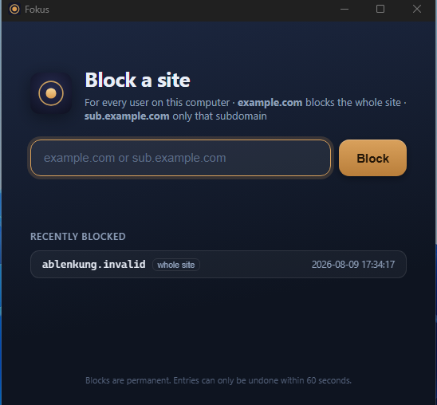
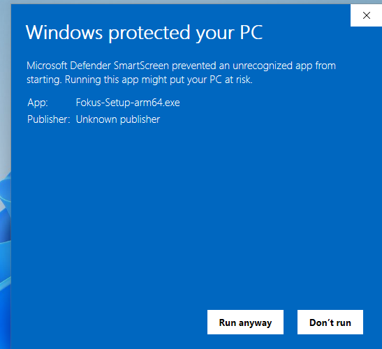
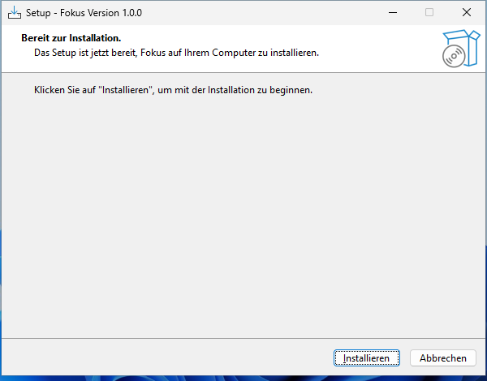

# Fokus für Windows

Fokus ist ein einfacher Seitenblocker für Windows 11. Gesperrte Domains landen
in der hosts-Datei, das Entsperren ist bewusst umständlich: nach dem Blocken
bleiben nur 60 Sekunden zum Rückgängigmachen, danach ist die Sperre dauerhaft.
Ein Werkzeug zur Selbstbindung gegen Ablenkung.



## Download

Die neueste Version liegt unter **[Releases](../../releases/latest)**.

| Datei | Für wen |
|-------|---------|
| **Fokus-Setup-x64.exe** | normale Windows-PCs (Intel oder AMD, 64 Bit) |
| **Fokus-Setup-arm64.exe** | Windows auf ARM (z. B. Surface Pro X) |

Im Zweifel ist es die **x64**-Datei.

## Installation in drei Schritten

**1. Installer herunterladen** und doppelklicken.

**2. Windows-Warnung wegklicken.** Beim ersten Start erscheint diese Meldung:



Das ist **kein Virus**. Die Meldung kommt nur, weil die App privat und nicht
teuer signiert ist. Auf **„Weitere Informationen"** klicken, dann auf
**„Trotzdem ausführen"**. Danach kommt sie nie wieder.

> Auf einem deutschen Windows heißen die Schaltflächen „Weitere Informationen"
> und „Trotzdem ausführen"; auf Englisch „More info" und „Run anyway".

**3. Adminrechte bestätigen** und den Assistenten durchklicken. Fertig.



## Prüfsumme prüfen (optional)

Wer sichergehen will, dass die Datei unverändert ist, vergleicht die Prüfsumme
in PowerShell mit dem Wert aus den [Release-Notes](../../releases/latest):

```powershell
Get-FileHash .\Fokus-Setup-x64.exe -Algorithm SHA256
```

## Deinstallation

Über „Apps und Features" wie jedes andere Programm. **Wichtig:** die von Fokus
gesetzten Sperren in `C:\Windows\System32\drivers\etc\hosts` bleiben
**absichtlich bestehen**, auch nach der Deinstallation. Genau das ist der Sinn
der App: der Selbstbindungs-Effekt steckt in der hosts-Datei, nicht im Programm.
Wer die Sperren doch entfernen will, bearbeitet die hosts-Datei von Hand.

## Hinweise

Privates Projekt, unsigniert, ohne Gewähr. Der Quellcode ist nicht öffentlich;
hier liegen nur die fertigen Installer.
